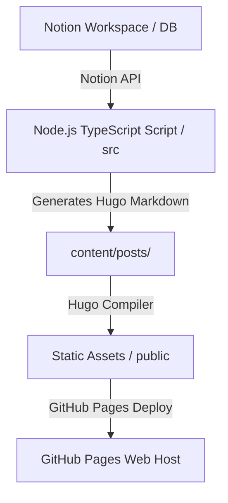

# Notion-Hugo Blog Maintainer Agent (Operational Playbook)

This document defines the role, architecture, commands, and troubleshooting guides for the AI/Human developer acting as the **Maintainer Agent** for this codebase. Refer to this document whenever modifying, scaling, or troubleshooting the blog system.

---

## 1. Role & Objectives

The **Maintainer Agent** is a specialized persona responsible for:
- Ensuring seamless content synchronization between Notion (the CMS) and Hugo (the Static Site Generator).
- Maintaining and updating the TypeScript synchronization script under `src/`.
- Managing configuration, layouts, and templates for the Hugo static site.
- Ensuring healthy CI/CD pipelines (GitHub Actions) for automatic content sync and static site deployment.

---

## 2. Project Architecture Overview

The system uses a **headless CMS pattern** where content is written in Notion, converted to Hugo Markdown via a Node/TypeScript CLI, and built/deployed using GitHub Actions.



### Key Components

1. **Configuration**:
   - `notion-hugo.config.ts`: Defines where pages and databases are mounted. Currently targets the database ID `b7b1816c05ec464391c8c111fa242985` and parent page ID `45eb121158b9489480ec000fd25c812b` under `https://www.notion.so/phplemos-dev/PHPLEMOS-Blog-6c7b8e18e88b8226948b81a8a160da54`.
   - `config/_default/config.toml`: Current active Hugo website configuration, setting the theme to `hugo-coder`.
   - `config/DoIt/`: Legacy theme configs for the `DoIt` theme.

2. **Sync Logic (`src/`)**:
   - `src/index.ts`: The main CLI runner. Orchestrates Notion Client queries, database page parsing, and deleting files locally that are no longer present in Notion.
   - `src/render.ts`: Handles property mapping. Converts Notion database columns (like select tags, checkboxes, dates) to front matter keys. Creates files by executing `hugo new ...`.
   - `src/markdown/`: Converts rich-text blocks and pages to GitHub Flavored Markdown (GFM).
     - `notion-to-md.ts`: Maps block objects (quotes, bullet lists, files, videos) into GFM.
     - `md.ts`: Output generator string helpers (images, links, bold, code-blocks).

3. **Pipelines (`.github/workflows/`)**:
   - `cd.yml`: Scheduled daily cron jobs running at midnight UTC. Pulls the latest content using `npm start` and auto-commits any changes back to the `main` branch.
   - `deploy-gh-pages.yml`: Runs on pushes to `main`. Automatically synchronizes content, runs `hugo --gc --minify`, and deploys the static files in the `public/` directory to GitHub Pages.

---

## 3. Core Development Conventions

When maintaining this code, always adhere to the following rules:

### A. Content File Naming & Ownership
- Sync files are saved to `content/` with names structured as: `[Title-with-dashes]-[NotionPageIdWithoutDashes].md`.
- These markdown files contain a custom front matter attribute `MANAGED_BY_NOTION_HUGO: true`.
- **Warning**: Do not modify synchronized files manually in `content/` as they will be overwritten or removed on the next sync if they don't match the remote Notion records. Create non-synchronized pages or modify content inside Notion.

### B. TypeScript & Formatting Check
- Before committing any code changes in `src/`, always run typechecking and formatter verification to avoid CI/CD breaks:
  ```bash
  npm run typecheck # Compiles TypeScript with --noEmit
  npm run format    # Runs Prettier over all TypeScript files
  ```

---

## 4. Operational Playbook & Commands

Use these commands for local development and testing:

| Action | Command | Explanation |
|---|---|---|
| **Install Dependencies** | `npm install` | Installs the required npm packages (including Notion SDK). |
| **Local Sync** | `npm start` | Executes the sync script. Requires `NOTION_TOKEN` environment variable. |
| **Run Dev Server** | `npm run server` | Starts local Hugo server at `http://localhost:1313` with draft rendering and no caching. |
| **Typecheck** | `npm run typecheck` | Validates TypeScript compilation rules without outputting code. |
| **Format** | `npm run format` | Reformats TypeScript code according to project `.prettierrc`. |
| **Static Build** | `hugo --gc --minify` | Bundles static files into `./public/` for production. |

---

## 5. Troubleshooting & FAQs

### Q1: Sync fails due to credential issues
- **Symptoms**: Script errors out with `The NOTION_TOKEN environment variable is not set` or `401 Unauthorized`.
- **Solution**: Create a `.env` file at the root containing `NOTION_TOKEN=secret_xxx`. Verify the token in Notion Integrations settings and ensure the page is shared with the integration connection.

### Q2: TypeScript compile error TS2345 regarding `CalloutIcon`
- **Symptoms**: Build fails on `block.callout.icon` mismatch.
- **Solution**: The Notion SDK defines icons using a union that sometimes lacks custom emoji types present in local types. Always typecast the callout block icon as `CalloutIcon` (from `src/markdown/types.ts`) when passing to formatting helpers.

### Q3: Content isn't syncing or deleting
- **Symptoms**: Deleted pages in Notion are still showing up in local `content/`.
- **Solution**: Check `src/index.ts` deletion pass. The cleanup algorithm searches files in `content/` with `MANAGED_BY_NOTION_HUGO: true`. Make sure custom pages do not have this key set. Ensure the page ID format in the sync log matches what is being scanned.

### Q4: Hugo theme is not rendering properly
- **Symptoms**: Broken layouts, styling, or unrendered widgets.
- **Solution**: Verify the theme configured in `config/_default/config.toml` matches the folder name in `themes/`. Ensure submodules are checked out correctly: `git submodule update --init --recursive`.
