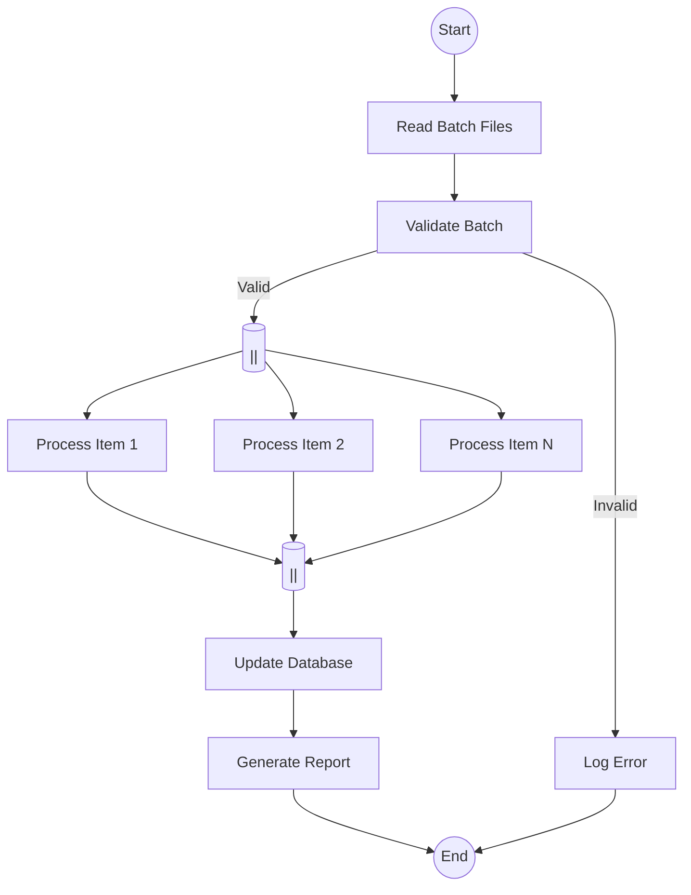

## 1. The feature 

On current project where i’m working on backend stack, we need connect to API Provider in this case **Nuvemshop**, request all products based on costumers store and persist on our database some information’s about each product. Initially we think some way to create this feature. But when started i ran into some problems.

- Problem 1: The API of our provider have a rate limit where they uses Leak bucket algorithm, where bucket size is 40 requests and limited to 2 requests per second.
- Problem 2:
- **The Goal here:** Briefly hook the reader and explain _why_ this task exists.
- **What to write about:** * Introduce the feature: Integrating a platform (Nuvemshop) with your system.
	- The core problem: Fetching large amounts of data (products) during an installation process without locking up the backend or keeping the user waiting.
	- The tech stack spoiler: Mention you chose BullMQ, PostgreSQL, and background workers to handle it asynchronously.

## 2. The Architecture (Visualizing the Solution)

- **The Goal here:** Show, don't just tell. This is where your diagram shines.
- **What to write about:**
	- Present the diagram you are currently creating.
	- Explain the separation of concerns: Why the backend shouldn't do the heavy lifting and why the Worker/BullMQ is necessary for this type of API integration.

## 3. Step-by-Step Execution Flow

- **The Goal here:** Break down the complex task into digestible logical steps.
- **What to write about:**
	- **Step 1: The Trigger:** Explain how the backend simply drops a message (the Store ID) into the queue upon Nuvemshop installation and moves on.
	- **Step 2: The Worker in Action:** Explain how the worker picks up the ID, queries the local PostgreSQL database for credentials/details, and starts fetching the Nuvemshop products.
	- **Step 3: Persistence:** Briefly mention the batch insertion back into PostgreSQL.

## 4. Overcoming the Bottlenecks: Rate Limits & Pagination

- **The Goal here:** This is the "meat" of the post where you show your advanced engineering skills.
- **What to write about:**
	- **Pagination:** How you structured the worker to loop through pages of products without dropping data.
	- **Rate Limiting & Error Handling:** Explain your retry strategy. If the Nuvemshop API says "too many requests" or throws an error, explain how you instruct BullMQ to put the message back in the queue with a delayed retry (the X time limit).

## 5. Automating the Future (The Scheduler)

- **The Goal here:** Show that you think about the lifecycle of the data, not just the initial setup.
- **What to write about:**
	- Explain the 2 AM Cron Job/Scheduler.
	- Mention the database migration (`last_provider_sync`) you created to track stale data.
	- Explain how the scheduler simply drops jobs into the _existing_ BullMQ queue, reusing the exact same worker logic you built for the installation phase.

## 6. Conclusion & Takeaways

- **The Goal here:** Wrap it up and highlight the business value of your technical choices.
- **What to write about:**
	- Summarize why decoupling this process makes the software scalable and resilient.
	- A brief closing thought on how mapping this out visually (the diagram) made the coding phase much more predictable.

